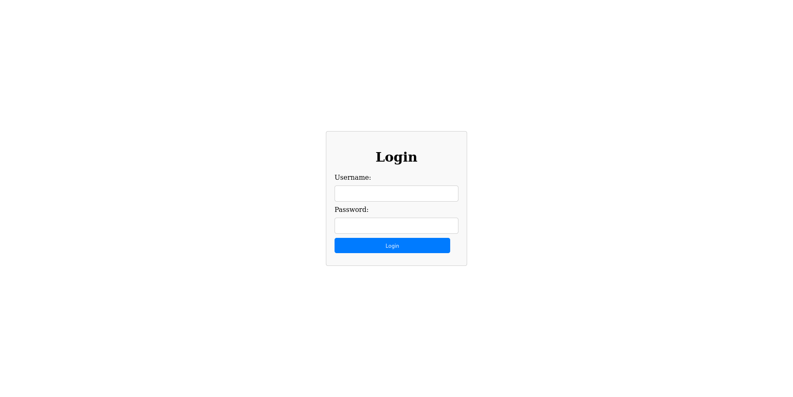
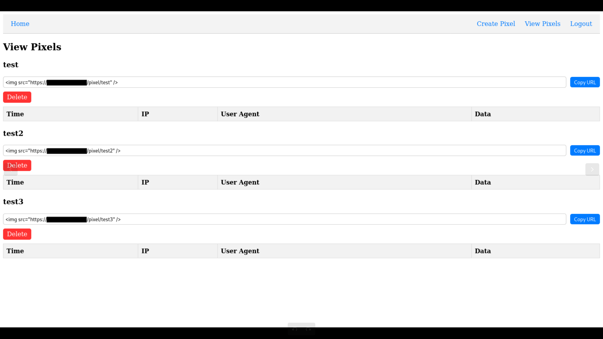
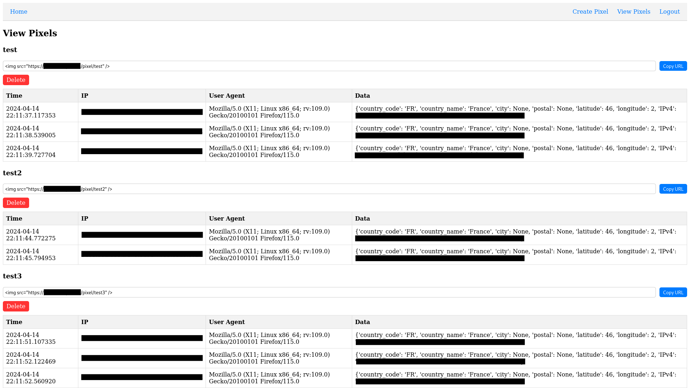

# SpyPixel

<p align="center">
  
</p>

SpyPixel is a lightweight spy pixel server crafted using Flask and SQLite, designed to provide simple yet effective tracking capabilities.

## Quick Start

To get started with SpyPixel, follow these steps to set up your environment and launch the server.

### Environment Variables

First, create a `.env` file in the `src/` directory with the following variables:

```bash
SECRET_KEY=your_secret_key          # A secret key for Flask sessions
DATABASE_URL=sqlite:///site.db      # Path to your SQLite database
ADMIN_PASSWORD=your_admin_password  # Password for the admin panel
DOMAIN_NAME=your_domain_name        # Your domain name for creating pixels
```

Make sure to replace the placeholder text with your actual secret key, admin password, and domain name.

### Dockerfile

SpyPixel is Docker-ready, allowing for easy deployment. To build and run the Docker container, execute the following commands:

```bash
# Build the Docker image
docker build -t spypixel .

# Run the container on port 5000, mounting the current directory
docker run -p 5000:5000 -v $(pwd):/app spypixel
```

### Accessing the Server

Once the server is running, you can access it in a web browser at http://localhost:5000.
If you are deploying to a different domain, ensure your Docker setup and `.env` file reflect the correct configurations.

### Features

- User Authentication: Secure login system for the admin panel.
- Pixel Management: Create, view, and manage tracking pixels.
- Logs: Review logs for tracking activities.
- Scalable Deployment: Use Docker for deployment flexibility.

## Screenshots

Here are some screenshots showcasing SpyPixel's user interface and functionality:

#### Login

<p align="center">
  
</p>

#### Create a pixel

<p align="center">
  
</p>

#### View pixels

<p align="center">
  
</p>

#### View logs

<p align="center">
  
</p>

> [!IMPORTANT]
> SpyPixel is designed for educational purposes. It is intended to demonstrate basic tracking techniques and is not meant for malicious use or unauthorized surveillance. Please use this tool responsibly and always comply with applicable privacy laws and regulations.

---
We hope you find SpyPixel useful. If you have any questions or would like to contribute, feel free to open an issue or submit a pull request.
